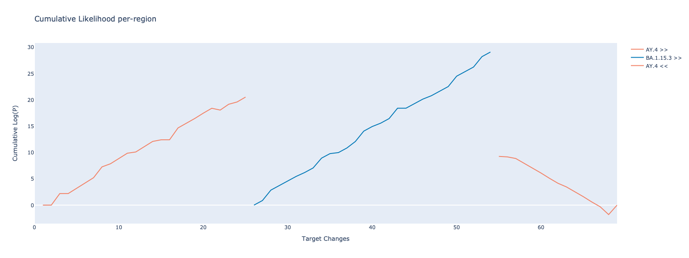

# RecombinHunt-CoV

This repository contains the material and source code referenced and documented in the following pre-print manuscript:

> [Data-driven recombination detection in viral genomes](https://doi.org/10.1038/s41467-024-47464-5),
>
> Tommaso Alfonsi, Anna Bernasconi, Matteo Chiara, Stefano Ceri
>
> Nature Communications 15, 3313 (2024); doi: https://doi.org/10.1038/s41467-024-47464-5

RecombinHunt (alias for the software contained in this repository) is a Python library implementing a data-driven novel method for identifying contributing lineages and breakpoints in recombinant viral sequences.

## Installation

Installation requires Python 3.10 and PIP. The software is independent of the operating system.
It is suggested to use a dedicated python environment (e.g., conda, miniconda or venv). Below, it is described how to create one with conda.

#### System requirements


Here we describe how to create a conda environment suitable for the installation of RecombinHunt. If you already know how to create one or want to use a different virtual environment, you can safely skip this subsection.

1. Follow the instructions at https://docs.conda.io/en/latest/miniconda.html# to download and install the latest miniconda version.
2. Create and activate a dedicated conda environment with Python 3.10 and PIP
    ```bash
   $ conda create -n rh_env python=3.10 pip
   $ conda activate rh_env
    ```

Once the prerequisites are satisfied, move into the RecombinHunt-CoV directory and install the package with:  

```bash
$ pip install recombinhunt-3.3.3-py3-none-any.whl
```

The installation procedure will take ~ 1 minute (depending on internet connection speed) and install the following packages:
```
python 3.10
numpy 1.24.2
pandas 1.5.3
plotly 5.14.0
tqdm 4.65.0
inflect 6.0.2
tabulate 0.9.0
kaleido 0.2.1
jupyter 1.0.0
```


 
## Usage

This package already provides the context information (*environment*) that are needed to evaluate the sequences. (The given *environment* is compressed to save storage space; please unzip it before proceeding). 

You can load any suitable environment as:
```python
from recombinhunt.core.environment import Environment
env = Environment("environments/env_nextstrain_2023_03_30") # <- path to the unzipped environment folder
```

and the intra-lineage relationships as:
```python
from recombinhunt.validation.utils import LineageHierarchy
lh = LineageHierarchy("validation_data/alias_key.json")
```

At the core of the package is the *Experiment* class, which analyses a single sequence and detects if the input is a recombination, the contributing 
lineages and the breakpoint position. 
To run an Experiment, you need to provide the *Environment* and a target sequence:

```python
from recombinhunt.core.method import Experiment

experiment = Experiment(environment=env, lineage_hierarchy=lh)

experiment.set_target(example_seq)  # <- your target sequence

result = experiment.run()
```
Results can be displayed by simply calling ```print(result) ```. An example output looks like this:
```json
target length : 69 
designated candidates :  AY.4 + BA.1.15.3 + AY.4  
region details :   1 
                    pos_start_in_t : 1 
                    pos_end_in_t : 25 
                    designated :  AY.4
                  2 
                    pos_start_in_t : 26 
                    pos_end_in_t : 54 
                    designated :  BA.1.15.3
                  3 
                    pos_start_in_t : 55 
                    pos_end_in_t : 69 
                    designated :  AY.4
AIK :  AY.4 : 350.2372865177939 
       BA.1.15.3 : 1452.8035425553069
       AY.4 + BA.1.15.3 + AY.4 : -412.89739429828103  
p_values :  AY.4 + BA.1.15.3 + AY.4 vs AY.4 :  1.93e-166  
            AY.4 + BA.1.15.3 + AY.4 vs BA.1.15.3 :  0.00e+00
```

Likelihood ratio can be visualized with:
```python
from recombinhunt.core.graphics import *

plot_likelihood(result.genome_view, xaxis="changes")
```



#### Experiment's parameters
The behavior of RecombinHunt can be modified for all the Experiment instances by overriding the default parameters of the Experiment class. 
The changes take effect on the next run of the Experiment. 
```python
from recombinhunt.core.method import Experiment

 Experiment.MIN_SEARCHABLE_REGION_LENGTH_TO = 3
 Experiment.MIN_CANDIDATE_REGION_LENGTH = 3
 Experiment.MIN_L2_ENCLOSED_REGION_LENGTH = 2
 Experiment.ALT_CANDIDATE_P_VALUE_DIFFERENCE = 1e-05
 Experiment.ALT_CANDIDATE_MAX_POS_DISTANCE_T = 1
```

## Demo

In the ```demo/``` directory, you can run find the Jupyter Notebook ```recombinant_cases_nextstrain.ipynb```. This 
notebook computes the recombinant cases in Nextstrain dataset using the consensus of all the sequence of 
good quality found for each recombinant case. 

#### Demo input
The original nucleotide sequences are
stored in ```demo/demo_input_nextstrain``` - for example, the sequences of recombinant case XD are stored in 
```demo/demo_input_nextstrain/sampels_XD.csv```. For each case, the consensus sequence is computed at runtime.

#### Demo output
The notebook produces two files stored in ```demo/demo_input_nextstrain```:
- *summary.md* is a markdown file organising the output of RecombinHunt in a tabular form (one row for each case) and 
comparing the output against the ground truth when available.
- *detail.html* is an HTML file that can be viewed in a browser (internet connection is required to load the 
plotting library). This file contains a more detailed output of RecombinHunt; it includes the plot of the likelihood 
ratio for the candidate lineages contributing to a recombination, and the consensus sequence for each case.

#### Expected run time
The demo runs in ~ 8 minutes. 

#### Instructions
The demo is a Juputer notebook and requires a Jupyter server to run.
The RecombinHunt package will automatically install Jupyter among its dependencies. To start a jupyter server locally, 
open a terminal, move inside the directory where RecombinHunt is located and run:
```bash
$ jupyter-notebook
```
In case the browser doesn't open automatically, you can click on the link printed in the terminal (the URL 
will be similar to http://localhost:8888/?token=5f38de823...). Once the browser is open, navigate to the demo directory
and execute every cell of the notebook.

## Data

This package already contain some data in order to ease the testing of the software.
Included data files are: 
-  ```demo/demo_input_nextstrain```: nucleotide sequences of recombinant cases downloaded from Nextstrain. Only the 
sequences satisfying our quality filters were retained.
- ```environments/env_nextstrain_2023_03_30```: information about the probability of nucleotide changes globally and 
for each lineage.
- ```validation_data/alias_key.json```: File of recombinant definitions provided from PANGO GitHub repository.


## Source code

The source code is located in the ```src/``` directory.

## Acknowledgements

This project is run by 
- Tommaso Alfonsi - PhD candidate - Politecnico di Milano - tommaso.alfonsi@polimi.it
- Anna Bernasconi - Assistant Professor - Politecnico di Milano - anna.bernasconi@polimi.it
- Matteo Chiara - Associate Professor - Università degli Studi di Milano - matteo.chiara@unimi.it
- Stefano Ceri - Full Professor - Politecnico di Milano - stefano.ceri@polimi.it


## License
<a rel="license" href="http://creativecommons.org/licenses/by-nc-nd/4.0/"></a><br />This work is licensed under a <a rel="license" href="http://creativecommons.org/licenses/by-nc-nd/4.0/">Creative Commons Attribution-NonCommercial-NoDerivatives 4.0 International License</a>.
 


